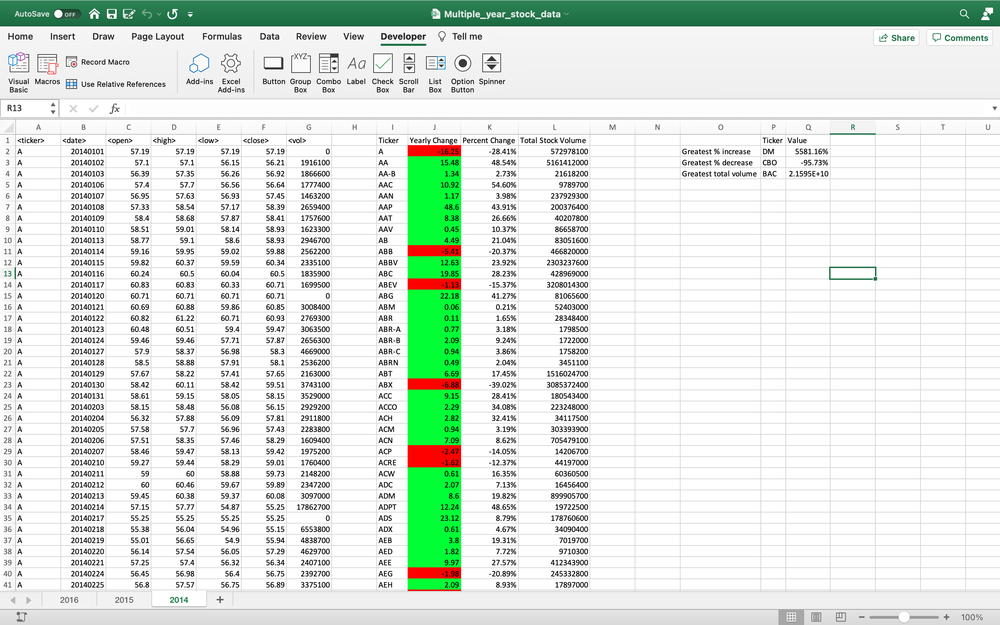

#  VBA scripting to analyze real stock market data

 In this project I used VBA scripting to analyze real stock market data. 

## The work done in this Project

* Created a script that looped through all the stocks for one year and outputed the following information.

  * The ticker symbol.

  * Yearly change from opening price at the beginning of a given year to the closing price at the end of that year.

  * The percent change from opening price at the beginning of a given year to the closing price at the end of that year.

  * The total stock volume of the stock.

* Conditional formatting that highlighted positive change in green and negative change in red.

## BONUS

* Solution also able to return the stock with the "Greatest % increase", "Greatest % decrease" and "Greatest total volume".

The solution looks as follows:

